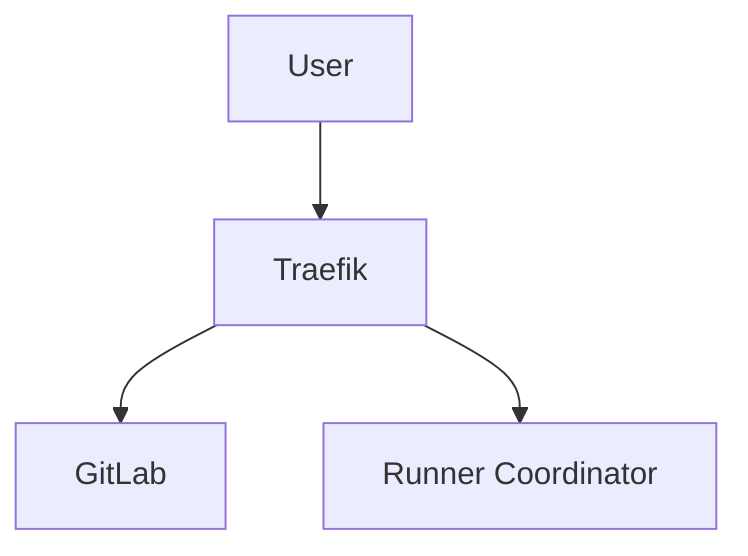

# Documentation Guidelines

This guide covers how to write and maintain documentation for AutoGit.

## Documentation Principles

1. **Documentation is code** - Same rigor, same commit, same review
2. **Keep it current** - Update docs with every code change
3. **Make it discoverable** - Use INDEX.md as source of truth
4. **Write for humans** - Clear, concise, with examples
5. **Show, don't just tell** - Include code examples and diagrams

## Documentation Structure

All documentation lives in `docs/`:

```
docs/
├── INDEX.md              # Master index - START HERE
├── installation/         # Installation guides
├── configuration/        # Configuration reference
├── architecture/         # Architecture and ADRs
│   └── adr/             # Architecture Decision Records
├── development/          # Development guides
├── runners/              # Runner management
├── gpu/                  # GPU support
├── security/             # Security guidelines
├── operations/           # Operations and monitoring
├── api/                  # API documentation
├── cli/                  # CLI reference
├── tutorials/            # Step-by-step tutorials
└── troubleshooting/      # Problem solving guides
```

## Writing Documentation

### Markdown Format

All documentation uses Markdown with these conventions:

```markdown
# Page Title (H1 - only one per page)

Brief description of what this page covers.

## Section Heading (H2)

Content for this section.

### Subsection (H3)

More detailed content.

#### Sub-subsection (H4)

Use sparingly - prefer simpler structure.
```

### Code Blocks

Always specify language for syntax highlighting:

````markdown
```python
def example_function():
    return "Hello, World!"
```

```bash
docker compose up -d
```

```yaml
configuration:
  key: value
```
````

### Links

Use relative links within documentation:

```markdown
See [Installation Guide](../installation/README.md) for setup.
See [API Reference](../api/runner-manager.md) for details.
```

### Examples

Always include practical examples:

```markdown
## Configuration Example

```yaml
runners:
  - name: docker-runner
    executor: docker
    limit: 10
```

This configuration creates a Docker runner with a maximum of 10 concurrent jobs.
```

## Documentation Types

### README Files

Every directory needs a `README.md`:

```markdown
# Component Name

Brief overview of the component.

## Overview

Detailed description of what this component does.

## Quick Start

Minimal example to get started.

## Documentation

- [Detailed Guide](detailed-guide.md)
- [Configuration](configuration.md)
- [API Reference](api-reference.md)

## Related Documentation

- [Parent Component](../parent/README.md)
- [Related Component](../related/README.md)
```

### Architecture Decision Records (ADRs)

Document all major architectural decisions:

```markdown
# ADR-XXX: Title of Decision

## Status

Accepted | Rejected | Deprecated | Superseded by [ADR-YYY](yyy-title.md)

## Context

What is the issue we're trying to solve?

## Decision

What decision did we make?

## Consequences

What are the implications of this decision?

## Alternatives Considered

What other options did we evaluate?
```

See [ADR Template](../architecture/adr/template.md) for the complete template.

### API Documentation

Document all public APIs:

```markdown
## Method Name

Brief description.

### Parameters

- `param1` (string, required) - Description
- `param2` (integer, optional) - Description. Default: 10

### Returns

Description of return value.

### Errors

- `ErrorType1` - When this error occurs
- `ErrorType2` - When this error occurs

### Example

```python
result = api.method_name(param1="value", param2=20)
```
```

### Configuration Documentation

Document all configuration options:

```markdown
## Configuration Option

### Type

string | integer | boolean | array | object

### Required

Yes | No

### Default

Default value (if applicable)

### Description

Detailed description of what this option controls.

### Example

```yaml
option_name: example_value
```

### Notes

Additional information, warnings, or best practices.
```

## Documentation Update Checklist

When you make code changes, update documentation:

- [ ] **README.md** - If changing core features
- [ ] **docs/INDEX.md** - If adding/removing docs
- [ ] **Component docs** - If modifying behavior
- [ ] **Configuration docs** - If adding/changing config
- [ ] **API docs** - If changing interfaces
- [ ] **ADRs** - If making architectural decisions
- [ ] **CHANGELOG.md** - For all changes in release
- [ ] **Testing docs** - If adding new test requirements
- [ ] **Security docs** - If adding security features

## Documentation Review

All PRs with code changes must include documentation updates.

### Review Checklist

- [ ] Documentation matches code behavior
- [ ] Examples are accurate and tested
- [ ] Links work (no broken links)
- [ ] Spelling and grammar are correct
- [ ] Formatting is consistent
- [ ] INDEX.md is updated (if needed)

## Documentation Testing

### Link Validation

```bash
# Check all links in documentation
npm install -g markdown-link-check
find docs -name "*.md" -exec markdown-link-check {} \;
```

### Example Code Validation

All code examples should be tested:

```python
# Test examples in docstring
import doctest
doctest.testmod()
```

## Documentation Maintenance

### Regular Reviews

- **Weekly** - Fix reported documentation issues
- **Monthly** - Review and update outdated content
- **Quarterly** - Comprehensive documentation audit

### Deprecation Process

When deprecating features:

1. Add deprecation notice to documentation
2. Update examples to show new approach
3. Keep deprecated docs for 2 versions
4. Remove after deprecation period

Example deprecation notice:

```markdown
> **⚠️ DEPRECATED**: This feature is deprecated and will be removed in v2.0.
> Use [new-feature](new-feature.md) instead.
```

## Style Guide

### Tone and Voice

- **Clear** - Use simple language
- **Concise** - Get to the point quickly
- **Helpful** - Focus on what users need
- **Professional** - Maintain technical accuracy

### Formatting Conventions

- Use **bold** for UI elements and important terms
- Use `code` for code, commands, and file paths
- Use *italics* sparingly for emphasis
- Use > blockquotes for notes and warnings

### Terminology

Be consistent with terminology:

- Use "runner" not "executor" or "worker"
- Use "GPU-aware" not "GPU-enabled" or "GPU-powered"
- Use "provision" not "create" or "spawn"

See [Glossary](../GLOSSARY.md) for complete terminology list.

## Documentation Tools

### Recommended Tools

- **VS Code** with Markdown extensions
- **Grammarly** for spelling/grammar
- **draw.io** or **Mermaid** for diagrams
- **markdown-link-check** for link validation

### Diagram Creation

Use Mermaid for diagrams in Markdown:

```markdown

```

## Getting Help

If you need help with documentation:

1. Check this guide first
2. Look at existing docs as examples
3. Ask in GitHub Discussions
4. Tag @docs-team in your PR

## Resources

- [Markdown Guide](https://www.markdownguide.org/)
- [Google Developer Documentation Style Guide](https://developers.google.com/style)
- [Write the Docs](https://www.writethedocs.org/)
